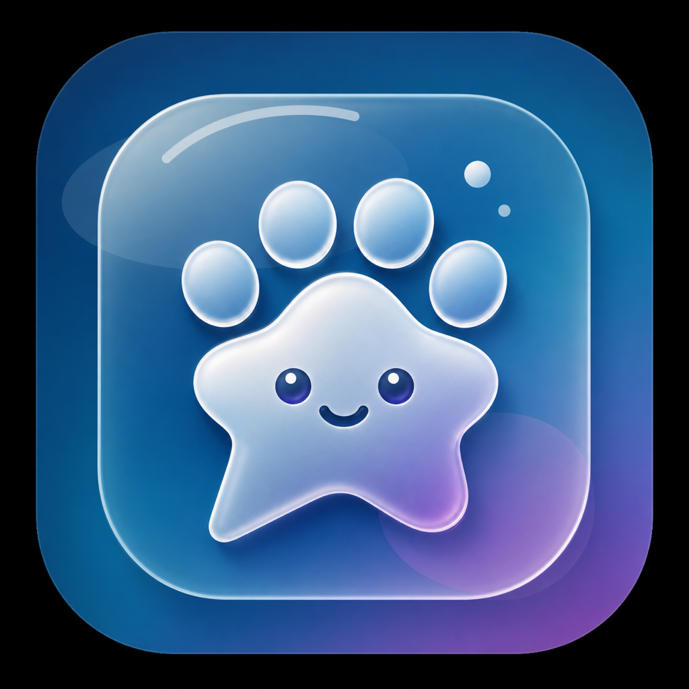

# Global Pet Assistant

<p align="center">
  
</p>

<p align="center">
  A local-first macOS desktop pet that turns coding-agent, terminal, and build events into a tiny companion on your screen.
</p>

<p align="center">
  <a href="README.zh-CN.md">中文</a>
  · <a href="docs/README.md">Docs</a>
  · <a href="docs/integrations.md">Integrations</a>
  · <a href="https://github.com/Retr0123456/global-pet-assistant/releases/latest">Download</a>
</p>

<p align="center">
  <a href="LICENSE"></a>
  <a href="https://github.com/Retr0123456/global-pet-assistant/releases/latest"></a>
  
  
</p>

Global Pet Assistant is a native AppKit utility for people who live in local
developer tools. It renders a transparent always-on-top pet, accepts local
events from trusted integrations, and turns those events into animations, quick
status flashes, and persistent agent-thread reminders.

The app is intentionally small: no hosted account, no cloud relay, no network
webhook listener by default. Your tools talk to a local server on
`127.0.0.1`, protected by a local bearer token.

## Highlights

| Area | What you get |
| --- | --- |
| Native desktop pet | Transparent AppKit window, drag-to-move, edge snapping, resizing, menu bar controls, and smooth spritesheet animation. |
| Coding-agent status | Codex hook support for running, waiting-for-approval, completed, and review states. |
| Terminal feedback | Kitty watcher plugin for command start/end flashes without editing shell startup files. |
| Local event API | `petctl` and localhost HTTP event ingestion for scripts, builds, and local tools. |
| Persistent reminders | Longer-lived thread panel items stay visible until dismissed instead of disappearing like toast notifications. |
| Conservative actions | Notification clicks can open allowlisted apps, URLs, files, folders, or supported terminal/session targets. |
| Pet packages | Codex-compatible `1536x1872` spritesheet packages can be imported into the app-owned pet directory. |

## Install

Download the latest DMG from
[GitHub Releases](https://github.com/Retr0123456/global-pet-assistant/releases/latest),
open it, and drag `GlobalPetAssistant.app` into `/Applications`.

```bash
open /Applications/GlobalPetAssistant.app
curl -fsS http://127.0.0.1:17321/healthz
```

The current beta is not notarized yet. If macOS blocks first launch, open the
app from Finder with Control-click -> Open, or allow it from System Settings.

## Quick Start

Choose one integration first. You can install both later.

### Kitty Command Flashes

Use this if kitty is your main terminal and you want command start/end feedback.

```bash
/Applications/GlobalPetAssistant.app/Contents/Resources/plugins/kitty/install.sh
```

Fully quit and reopen kitty, then run:

```zsh
sleep 3
false
```

`sleep 3` should show a short success flash. `false` should show a short failure
flash.

### Codex Session Reminders

Use this if you want the pet to track Codex lifecycle events.

```bash
/Applications/GlobalPetAssistant.app/Contents/Resources/Tools/install-codex-hooks.sh
```

Restart Codex sessions after installing. New prompts should mark the session as
running, approval-needed states should show as waiting, and completed turns
should appear in the thread panel until dismissed.

See the full guide in [Integration Setup](docs/integrations.md).

## How It Works

```text
Local tools / agents / terminal plugins
        |
        v
petctl, Codex hooks, Kitty watcher, localhost HTTP
        |
        v
Local event router + action allowlist
        |
        v
Pet animation, flash message, or thread reminder
```

Global Pet Assistant keeps runtime state under `~/.global-pet-assistant`:

| Path | Purpose |
| --- | --- |
| `~/.global-pet-assistant/token` | Local bearer token for event writes. |
| `~/.global-pet-assistant/config.json` | Source allowlist, pet import paths, and runtime preferences. |
| `~/.global-pet-assistant/logs/` | Runtime, event, and hook logs. |
| `~/.global-pet-assistant/pets/` | Imported or bundled pet packages. |

## Documentation

Start here:

- [Documentation Hub](docs/README.md): install, integration, architecture, and
  maintainer map.
- [Integration Setup](docs/integrations.md): Kitty plugin and Codex hooks.
- [Architecture](docs/architecture.md): renderer, event API, action model, and
  local security boundary.
- [Assets and Licensing](docs/assets-and-licensing.md): app icon and pet asset
  rules.
- [Security Policy](SECURITY.md): local event server, tokens, logs, and
  vulnerability reporting.
- [Contributing](CONTRIBUTING.md): development workflow and pull request
  expectations.

## Develop

Requirements:

- macOS 26 SDK or newer for the current AppKit surface.
- Swift 6.2 or newer.
- Xcode Command Line Tools.

```bash
swift build
swift test
Tools/package-debug-app.sh
open .build/GlobalPetAssistant.app
```

Runtime smoke checks:

```bash
swift run GlobalPetAssistant
Tools/verify-event-runtime.sh
```

`Tools/verify-event-runtime.sh` launches the app itself. Stop any already
running copy first if port `17321` is busy.

## Privacy

Global Pet Assistant is local-first:

- The event server binds to `127.0.0.1`.
- Event writes require `Authorization: Bearer <token>`.
- No hosted account or cloud telemetry is required.
- Unknown sources may send state notifications, but cannot open apps, URLs,
  files, folders, or terminal windows.

See [Privacy](PRIVACY.md) and [Security Policy](SECURITY.md) for the precise
runtime model.

## Uninstall

Quit the app, remove the bundle, and optionally remove app-owned state:

```bash
rm -rf /Applications/GlobalPetAssistant.app
rm -rf ~/.global-pet-assistant
```

If you installed integrations, also remove their managed config:

- Kitty: remove `~/.config/kitty/global-pet-assistant` and the marked include
  block in `~/.config/kitty/kitty.conf`.
- Codex hooks: remove managed commands containing
  `global-pet-agent-bridge --source codex` from `~/.codex/hooks.json`.
